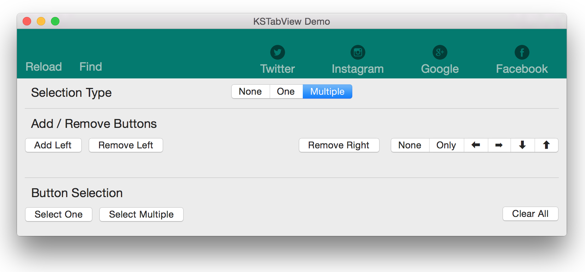

#KSTabView

`KSTabView` is simple and lightweight TabView for Mac OSX implemented in Swift


## Requirements
- Mac OS X 10.10+
- Xcode 6.3

##Usage
####Setup
Drag `KSTabView.swift` to you project.

In IB, drag a Custom View from Object Library. Set Custom Class to KSTabView

Drag IBOutlet to ViewController
```swift
@IBOutlet weak var tabView: KSTabView!
```
####Adding buttons
Buttons can be pushed either left or right Aligned
```swift
tabView.pushButtonLeft("Reload", identifier: "reload")       // Adds Button with title "Reload" and identifier "reload" aligned Left
tabView.pushButtonRight("Jump", identifier: "jump")
```
Identifier is must, as the action event will receive this identifier String as an argument

####Button Actions
Handling the button clicks is as easy as creating an IBAction in view controller
```swift
@IBAction func actionOccured(sender: NSString?) {
    println("\(sender) pressed")         // Prints the identifier of button that is clicked
}

```
####Removing buttons
Buttons can be removed, so that new ones can be added
```swift
tabView.removeLeftButtons()            //Removes all the Left aligned buttons
tabView.removeRightButtons()           //Removes all the Right aligned buttons
```
####Modes of operation
KSTabview has 3 modes of operation viz `None`, `One`, `Any`
```swift
tabView.selectionType = .None       // No selection happens.(Only action triggers)
tabView.selectionType = .One        // Only the latest selection stays
tabView.selectionType = .Any        // Multiple buttons can be selected
```
####Chaining
Methods that are not intended to return anything return self, to facilitate method chaining
```swift
tabView.removeRightButtons()
    .pushButtonRight("Help", identifier: "help")
    .pushButtonRight("Modify", identifier: "modify")
    .pushButtonRight("Delete", identifier: "delete")
    .pushButtonRight("New", identifier: "new").selectedButtons = ["modify"]
```
##Todo
- Allow add buttons from Interface Builder
- Documentation
